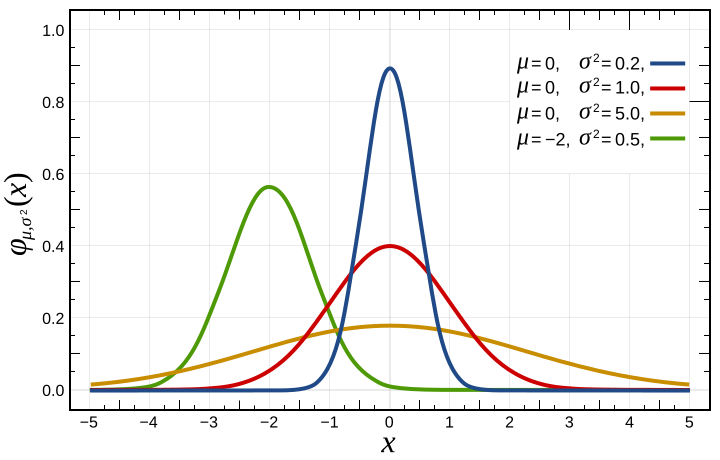

# Evaluation of Manifoldchain on AWS

## USF vs BCSF

This experiment aims to demonstrate the superiority of BCSF over USf. The key insight is to examine the TPS achieved by BCSF and USF under exactly **same** environmental settings.

### Setting

* The number of the shards: 10
* The number of the nodes within each shard: 5
* Block size (the number of transactions in each block): 2048
* The confirmation depth: 6 (but irrelevant to the result)
* Bandwidths: the nodes are configured with different bandwidths. Specifically, there are 5 possible bandwidth presences: {5mbps, 10mbps, 20mbps, 40mbps, 60mbps}. The percentage of each bandwidth is the same, which means that, there are 10 nodes configuring with 5 mbps, 10 nodes configuring with 10 mbps, etc. 
* Shard formation: 
    - USF: the nodes are uniformlly distrbuted, the distribution of the bandwidths is as follows:
        * shard 0: [5mbps, 10mbps, 20mbps, 40mbps, 60mbps]
        * shard 1: [5mbps, 10mbps, 20mbps, 40mbps, 60mbps]
        * shard 2: [5mbps, 10mbps, 20mbps, 40mbps, 60mbps]
        * shard 3: [5mbps, 10mbps, 20mbps, 40mbps, 60mbps]
        * shard 4: [5mbps, 10mbps, 20mbps, 40mbps, 60mbps]
        * shard 5: [5mbps, 10mbps, 20mbps, 40mbps, 60mbps]
        * shard 6: [5mbps, 10mbps, 20mbps, 40mbps, 60mbps]
        * shard 7: [5mbps, 10mbps, 20mbps, 40mbps, 60mbps]
        * shard 8: [5mbps, 10mbps, 20mbps, 40mbps, 60mbps]
        * shard 9: [5mbps, 10mbps, 20mbps, 40mbps, 60mbps]
    - BCSF: the nodes are clustered based on their bandwidths, the distribution of the bandwidths is as follows:
        * shard 0: [5mbps, 5mbps, 5mbps, 5mbps, 5mbps]
        * shard 1: [5mbps, 5mbps, 5mbps, 5mbps, 5mbps]
        * shard 2: [10mbps, 10mbps, 10mbps, 10mbps, 10mbps]
        * shard 3: [10mbps, 10mbps, 10mbps, 10mbps, 10mbps]
        * shard 4: [20mbps, 20mbps, 20mbps, 20mbps, 20mbps]
        * shard 5: [20mbps, 20mbps, 20mbps, 20mbps, 20mbps]
        * shard 6: [40mbps, 40mbps, 40mbps, 40mbps, 40mbps]
        * shard 7: [40mbps, 40mbps, 40mbps, 40mbps, 40mbps]
        * shard 8: [60mbps, 60mbps, 60mbps, 60mbps, 60mbps]
        * shard 9: [60mbps, 60mbps, 60mbps, 60mbps, 60mbps]
* Mining difficulty: the mining difficulty differs between **exclusive block** and **inclusive block**
    * USF: As shards share the same bandwidth configuration, they should also share the same mining difficulty. Based on theoretical analysis, they all mine inclusive blocks to achieve the highest TPS while providing the same security guarantee. After testing, a suitable inclusive mining difficulty is `0007ffffffffffffffffffffffffffffffffffffffffffffffffffffffffffff`.
    * BCSF
        - exclusive block: the mining difficulties for exclusive blocks (`ex_diff`) vary across shards, in a shard with high bandwidths, the `ex_diff` is low (making it easier to solve PoW puzzle), while in a shard with low bandwidths, the `ex_diff` is high (making it more difficult to solve PoW puzzle). Following the theoretical analysis in the paper, we use `numeric.py` code to calculate the `ex_diff` of each shard. Basically, the corresponding mining targets of each shard are as follows (a higher mining target means a lower mining difficulty):
            * shard 0: `0007ffffffffffffffffffffffffffffffffffffffffffffffffffffffffffff`
            * shard 1: `0007ffffffffffffffffffffffffffffffffffffffffffffffffffffffffffff`
            * shard 2: `000e7ae147ae147ae147ae147ae147ae147ae147ae147ae147ae147ae147ae12`
            * shard 3: `000e7ae147ae147ae147ae147ae147ae147ae147ae147ae147ae147ae147ae12`
            * shard 4: `00188f5c28f5c28f5c28f5c28f5c28f5c28f5c28f5c28f5c28f5c28f5c28f5bf`
            * shard 5: `00188f5c28f5c28f5c28f5c28f5c28f5c28f5c28f5c28f5c28f5c28f5c28f5bf`
            * shard 6: `0025851eb851eb851eb851eb851eb851eb851eb851eb851eb851eb851eb851e6`
            * shard 7: `0025851eb851eb851eb851eb851eb851eb851eb851eb851eb851eb851eb851e6`
            * shard 8: `002d999999999999999999999999999999999999999999999999999999999993`
            * shard 9: `002d999999999999999999999999999999999999999999999999999999999993`
        - inclusive block: the mining difficulty for inclusive blocks is `0007ffffffffffffffffffffffffffffffffffffffffffffffffffffffffffff`, the same as the highest mining difficulty for exclusive blocks. In such case, the slowest shard, shard 0, mines only inclusive blocks. 

## Horizontal Scalability

This experiment is to demonstrate and compare the horizontal scalability of USF and BCSF. We fix the number of nodes within each shard, and the TPS is expected to improve linearly when increasing the number of shards. Furthermore, the increasing TPS of BCSF is expected to be faster than that of USF.

### Setting

* The number of shards: [1, 2, 3, 4, 5, 6, 7, 8, 9]
* The number of nodes within each shard: 5
* Block size (the number of transactions in each block): 2048
* Bandwidths: The same as the first experiment, there are 5 bandwidth presences: {5mbps, 10mbps, 20mbps, 40mbps, 60mbps}. The experiment starts with 5 nodes, 1 shard with bandwidths of {5mbps, 10mbps, 20mbps, 40mbps, 60mbps}, and with each shard expansion, 5 nodes with bandwidths of {5mbps, 10mbps, 20mbps, 40mbps, 60mbps} are added. 
* Shard formation:
    - USF: 
        * 1 shard: [5mbps, 10mbps, 20mbps, 40mbps, 60mbps]
        * 2 shard: [5mbps, 10mbps, 20mbps, 40mbps, 60mbps]
                   [5mbps, 10mbps, 20mbps, 40mbps, 60mbps]
        * 3 shard: [5mbps, 10mbps, 20mbps, 40mbps, 60mbps]
                   [5mbps, 10mbps, 20mbps, 40mbps, 60mbps]
                   [5mbps, 10mbps, 20mbps, 40mbps, 60mbps]
        * 4 shard: [5mbps, 10mbps, 20mbps, 40mbps, 60mbps]
                   [5mbps, 10mbps, 20mbps, 40mbps, 60mbps]
                   [5mbps, 10mbps, 20mbps, 40mbps, 60mbps]
                   [5mbps, 10mbps, 20mbps, 40mbps, 60mbps]
        * ...
        * 10 shard: [5mbps, 10mbps, 20mbps, 40mbps, 60mbps]
                    [5mbps, 10mbps, 20mbps, 40mbps, 60mbps]
                    [5mbps, 10mbps, 20mbps, 40mbps, 60mbps]
                    [5mbps, 10mbps, 20mbps, 40mbps, 60mbps]           
                    [5mbps, 10mbps, 20mbps, 40mbps, 60mbps]
                    [5mbps, 10mbps, 20mbps, 40mbps, 60mbps]
                    [5mbps, 10mbps, 20mbps, 40mbps, 60mbps]
                    [5mbps, 10mbps, 20mbps, 40mbps, 60mbps]
                    [5mbps, 10mbps, 20mbps, 40mbps, 60mbps]           
                    [5mbps, 10mbps, 20mbps, 40mbps, 60mbps]
    - BCSF
        * 1 shard: [5mbps, 10mbps, 20mbps, 40mbps, 60mbps]
        * 2 shard: [5mbps, 5mbps, 10mbps, 10mbps, 20mbps]
                   [20mbps, 40mbps, 40mbps, 60mbps, 60mbps]
        * 3 shard: [5mbps, 5mbps, 5mbps, 10mbps, 10mbps]
                   [10mbps, 20mbps, 20mbps, 20mbps, 40mbps]
                   [40mbps, 40mbps, 60mbps, 60mbps, 60mbps]
        * ...
        * 10 shard: [5mbps, 5mbps, 5mbps, 5mbps, 5mbps]
                    [5mbps, 5mbps, 5mbps, 5mbps, 5mbps]
                    [10mbps, 10mbps, 10mbps, 10mbps, 10mbps]
                    [10mbps, 10mbps, 10mbps, 10mbps, 10mbps]
                    [20mbps, 20mbps, 20mbps, 20mbps, 20mbps]
                    [20mbps, 20mbps, 20mbps, 20mbps, 20mbps]
                    [40mbps, 40mbps, 40mbps, 40mbps, 40mbps]
                    [40mbps, 40mbps, 40mbps, 40mbps, 40mbps]
                    [60mbps, 60mbps, 60mbps, 60mbps, 60mbps]
                    [60mbps, 60mbps, 60mbps, 60mbps, 60mbps]
* mining difficulty
    - USF: the mining difficulties of USF are always the same, and they only mine the inclusive blocks, specifically
        * 1 shard: [`0007ffffffffffffffffffffffffffffffffffffffffffffffffffffffffffff`]
        * 2 shard: [`0007ffffffffffffffffffffffffffffffffffffffffffffffffffffffffffff`,
                    `0007ffffffffffffffffffffffffffffffffffffffffffffffffffffffffffff`]
        * 3 shard: [`0007ffffffffffffffffffffffffffffffffffffffffffffffffffffffffffff`,
                    `0007ffffffffffffffffffffffffffffffffffffffffffffffffffffffffffff`,
                    `0007ffffffffffffffffffffffffffffffffffffffffffffffffffffffffffff`]
        * ...
        * 10 shard: [`0007ffffffffffffffffffffffffffffffffffffffffffffffffffffffffffff`,
                     `0007ffffffffffffffffffffffffffffffffffffffffffffffffffffffffffff`,
                     `0007ffffffffffffffffffffffffffffffffffffffffffffffffffffffffffff`,
                     `0007ffffffffffffffffffffffffffffffffffffffffffffffffffffffffffff`,
                     `0007ffffffffffffffffffffffffffffffffffffffffffffffffffffffffffff`,
                     `0007ffffffffffffffffffffffffffffffffffffffffffffffffffffffffffff`,
                     `0007ffffffffffffffffffffffffffffffffffffffffffffffffffffffffffff`,
                     `0007ffffffffffffffffffffffffffffffffffffffffffffffffffffffffffff`,
                     `0007ffffffffffffffffffffffffffffffffffffffffffffffffffffffffffff`,
                     `0007ffffffffffffffffffffffffffffffffffffffffffffffffffffffffffff`]
    - BCSF: the mining difficulties for exclusive blocks are based on the minimul bandwidth within the shard, and we have the following mapping:
        * 5mbps -- `0007ffffffffffffffffffffffffffffffffffffffffffffffffffffffffffff`
        * 10mbps -- `000e7ae147ae147ae147ae147ae147ae147ae147ae147ae147ae147ae147ae12`
        * 20mbps -- `00188f5c28f5c28f5c28f5c28f5c28f5c28f5c28f5c28f5c28f5c28f5c28f5bf`
        * 40mbps -- `0025851eb851eb851eb851eb851eb851eb851eb851eb851eb851eb851eb851e6`
        * 60mbps -- `002d999999999999999999999999999999999999999999999999999999999993`
        and the mining difficultiy for inclusive blocks is the same as the highest mining difficulty for exclusive blocks, specifically
            - 1 shard: [`0007ffffffffffffffffffffffffffffffffffffffffffffffffffffffffffff`]
            - 2 shard: [`0007ffffffffffffffffffffffffffffffffffffffffffffffffffffffffffff`,
                        `00188f5c28f5c28f5c28f5c28f5c28f5c28f5c28f5c28f5c28f5c28f5c28f5bf`]
            - 3 shard: [`0007ffffffffffffffffffffffffffffffffffffffffffffffffffffffffffff`,
                        `000e7ae147ae147ae147ae147ae147ae147ae147ae147ae147ae147ae147ae12`,
                        `0025851eb851eb851eb851eb851eb851eb851eb851eb851eb851eb851eb851e6`]
            - ...
            - 10 shard: [`0007ffffffffffffffffffffffffffffffffffffffffffffffffffffffffffff`,
                         `000e7ae147ae147ae147ae147ae147ae147ae147ae147ae147ae147ae147ae12`,
                         `00188f5c28f5c28f5c28f5c28f5c28f5c28f5c28f5c28f5c28f5c28f5c28f5bf`,
                         `0025851eb851eb851eb851eb851eb851eb851eb851eb851eb851eb851eb851e6`,
                         `002d999999999999999999999999999999999999999999999999999999999993`]

## Vertical Scalability

This experiment is to demonstrate and compare the vertical scalability of USF and BCSF. We increase the bandwidths in different ways:

* Only increase the slow nodes' bandwidths
* Only increase the fast nodes' bandwidths
* Evenly increase the bandwidths

We determine the bandwidth distribution based on normal distribution:

* Increase $\mu$, and decrease $\sigma$
* Increase $\mu$, and increase $\sigma$
* Increase $\mu$, and fix $\sigma$

We do sampling uniformly along the X-axis. Specifically, in a scenario described as follos:
* 50 nodes
* given $\mu$ and $\sigma$
* bandwidths vary from [$\mu - \alpha$, $\mu + \alpha$]

Then we choose [$\mu-\alpha$, $\mu-\alpha$ + $\frac{2\alpha}{50}$, $\mu-\alpha + 2\frac{2\alpha}{50}$, ..., $\mu + \alpha - \frac{2\alpha}{50}$], and get the corresponging y value as the bandwidth.

        