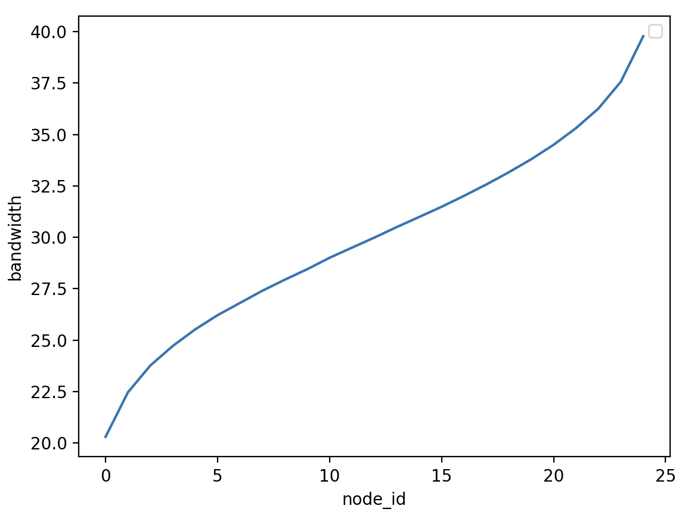
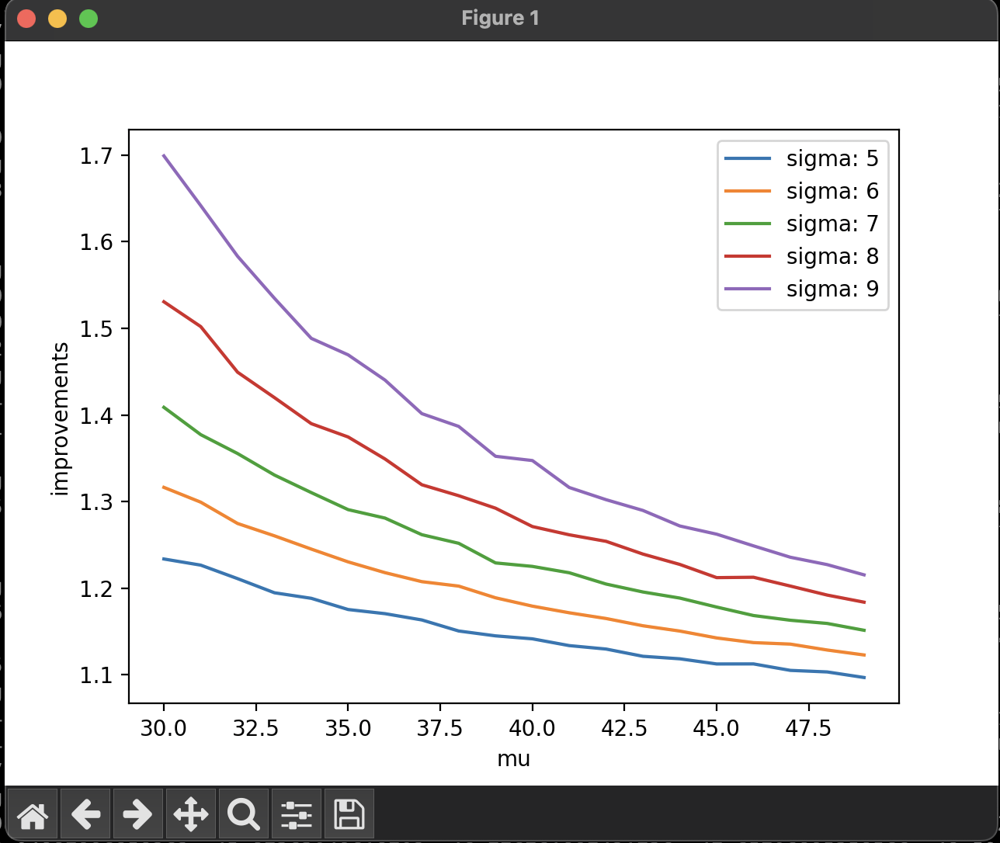
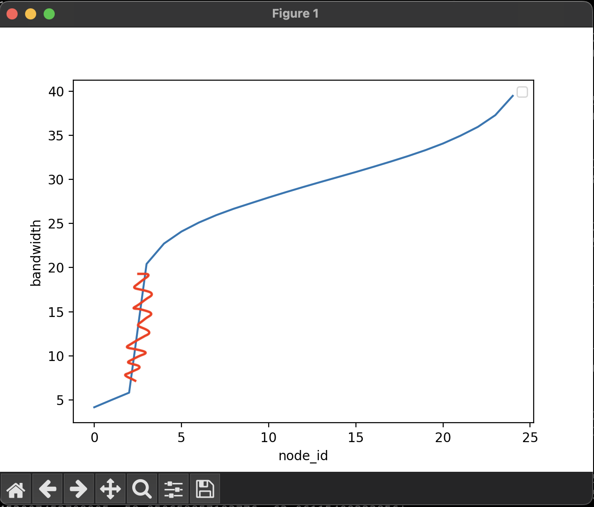
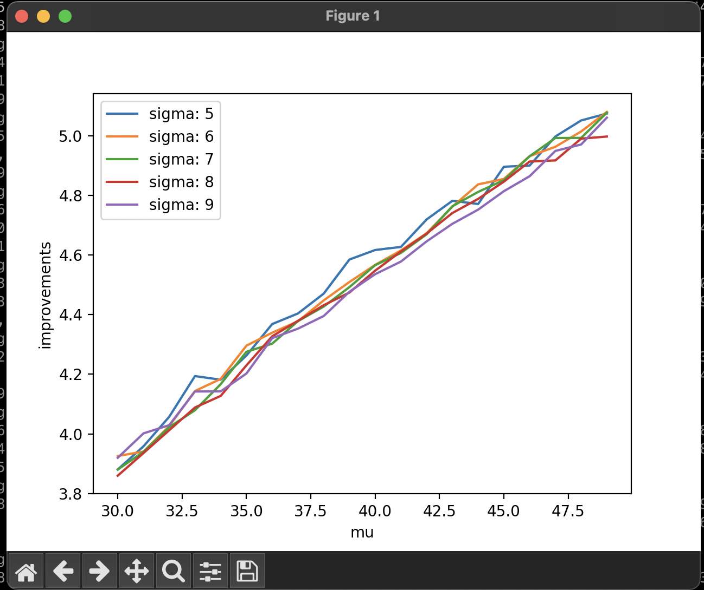

# Experiment for Vertical Scalability

This report discusses the experimental plans of demonstrating the Manifoldchain's vertical scalability, and some associated problems.

## Why I want this experiment?

I want to show the superiority of Manifoldchain on vertical scalability over other sharding protocols (BCSF vs USF, in fact), the experimental results are expected to indicate the following key point:

* BCSF is expected to have better improvement than USF under the same increments of bandwidths. In other words, the TPS of Manifoldchain employing BCSF should grow faster than that employing USF.

## Experimental Setting

The key problem of experimental setting is how to increase the bandwidths with reason. Following a general distribution in the real scenarios is a naive setting. However, there is not any general distribution which can represent all bandwidth distributions in different scenarios. The bandwidth distributions vary from different scenarios, which are difficult to be quantified with lots of parameters involved. Therefore, I want to use a normal distribution to simulate the bandwidth setting (because we dont have better choices). 

## How the experiment runs?

We start with sampling of a normal distribution, we can achieve this using Python:

```
normal_samples = np.random.normal(mu, sigma, sample_num)
```

`mu` and `sigma` are two standard parameters of a normal distribution, and `sample_num` denotes how many samples we need. Specifically, if there are 50 nodes in the network, `sample_num`=50.

Now we got one result of sampling. In order to get its expectation (then we dont need to run many experiments to get the expectation), we can use the following Python code:

```
groups = []
for i in range(iteration):
    #normal_samples = np.random.normal(mu, sigma, sample_num)
    normal_samples = np.random.normal(mu, sigma, int(sample_num*normal_weight))
    tail_samples = np.random.normal(tail_mu, tail_sigma, sample_num - int(sample_num*normal_weight))
    samples = np.concatenate((normal_samples, tail_samples))
    samples.sort()
    groups.append(samples)
average_samples = []
for i in range(sample_num):
    vertical_samples = []
    for j in range(iteration):
        vertical_samples.append(groups[j][i])
    average_samples.append(vertical_samples)
average_samples = [np.mean(samples) for samples in average_samples]
```

In this Python code, I do about 1000 sampling, and take the mean value over these samples. Then we can obtain bandwidths of these 50 nodes:



Now we start with `mu`=30, `sigma`=5, and increase `mu` and `sigma` simultaneously, and evaluate the improved TPS of BCSF compared with USF. Specifically, `mu` varies from 30 to 50, and `sigma` varies from 5 to 10. For each pair of `mu` and `sigma`, we run BCSF and USF respectively. Even though I havent run these experiments, I can know the results in advance by the preset mining difficulties. The mining difficulties of each shard depends on the lowest bandwidth in the network and the highest mining difficulty. For instance, assuming the lowest bandwidth is 5mbps, and its shard's corresponding mining difficulty is `fff...fff`. The mining difficulty of another shard with lowest bandwidth of 10mbps is calculated by a specific equation, which can be demonstrated by the following Python code:

```
def cal_target(bandwidth, base_bandwidth, base_target, block_size, propagation_delay):
    base_target = int(base_target, 16)
    base_delay = (block_size*1024*8)/(base_bandwidth*1000000) + propagation_delay

    delay = (block_size*1024*8)/(bandwidth*1000000) + propagation_delay
    print("scale:{}".format(base_delay / delay))
    scale = int(base_delay * 100 / delay)
    print("scale:{}".format(scale))
    target = base_target * scale // 100
    return target
```

In summay, we can calculate the TPS of BCSF and USF if we know all the bandwidths, and hence predict the experimental results:



### How to analyze the result?

The y-axis, improvements, represents the improved TPS of BCSF compared with USF. Formally, 

$$
Improvements = \frac{TPS\ achieved\ by\ BCSF}{TPS\ achived\ by\ USF}
$$

* Different `sigma`: greater `sigma`, greater improvement, this is because the BCSF has some shards configured with fast mining rates, while the USF has all shards configured with the slowest mining rate.
* Different `mu`: greater `mu`, smaller improvement. This is because the TPSs achieved by BCSF and USF increase linearly with the linear increment of bandwidths, their quotient decreases in this case.

## What is the problem here?

The problem is obvious. The improved TPS decreases with the increasing `mu`, which is not the advantage of Manifoldchain. We want to show the superiority of Manifoldchain on vertical scalability, but the experimental result can not support this.

## Any other solutions?

As Manifoldchain aims to tackle the challenges caused by the stragglers, we can use a distribution considering the presence of stragglers. This distribution should satisfies the following two characteristics:
* Most of the samples follow normal distribution
* A small portion of samples are extremely small

This distribution describes a scenario: most of the nodes are configured with normal bandwidths, following the normal distribution, while a few nodes (stragglers) are configured with low bandwidths, following another distribution. We can use Mixture Distribution to model this scenario. Specifically, we have two normal distributions with different weight.

* Normal distribution 1: `mu=range(30, 50)`, `sigma=range(5,10)`, weight=0.9
* Normal distribution 2: `mu=5`, `sigma=1`, weight=0.1

We combine the two normal distributions and get a new one

### How to do sampling from this distribution

Now we need to get 50 samples from this distribution. We initially get $50*0.9=45$ samples from normal distribution 1, and then get $50-45=5$ samples from normal distribution 2. Therefore, we get 50 samples from this mixture normal distribution. Similarly, we do 1000 sampling and get the expectation:



### Why do I use mixture normal distribution?

An important fact is that Manifoldchain works better in the presence of **stragglers**. The stragglers force USF to configure all the shards with the slowest mining rate, while BSCF enables some fast shards to have faster mining rates. Let's see the performance under this setting:



* The improvements increase linearly with the linear increment of `mu`
* There is not significant difference among varying `sigma`

In this setting, the TPS of USF remains almost still when increasing `mu`, because its TPS depends on the normal distribution 2 (the distribution of stragglers), which is fixed. Besides, TPSs achieved of BCSF under different `sigma` are almost the same, due to the same reason. 

## Conclusion

The original design of experiments has some problems and I want to polish it. However, I can not determine whether to execute on my own because it seems to have some problems. The main concern is whether the reviews can accept it. Because this experimental setup feels a bit like finding a solution just to match the answers. The reviewers may say "you do this just to get the expected results but it is completely unrealistic".